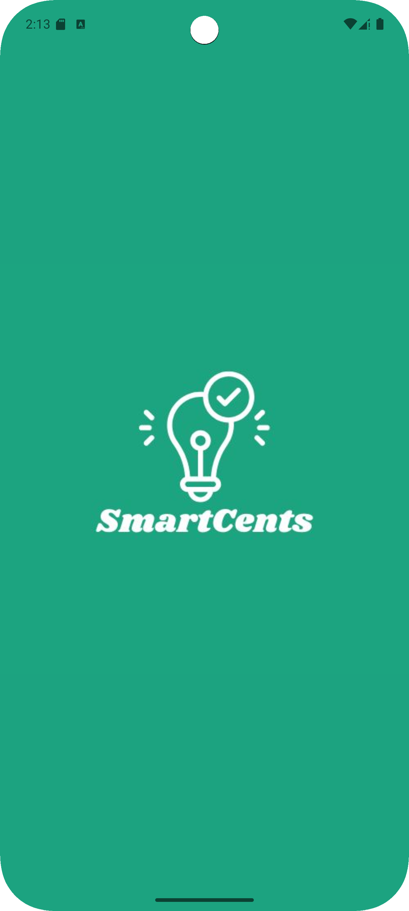
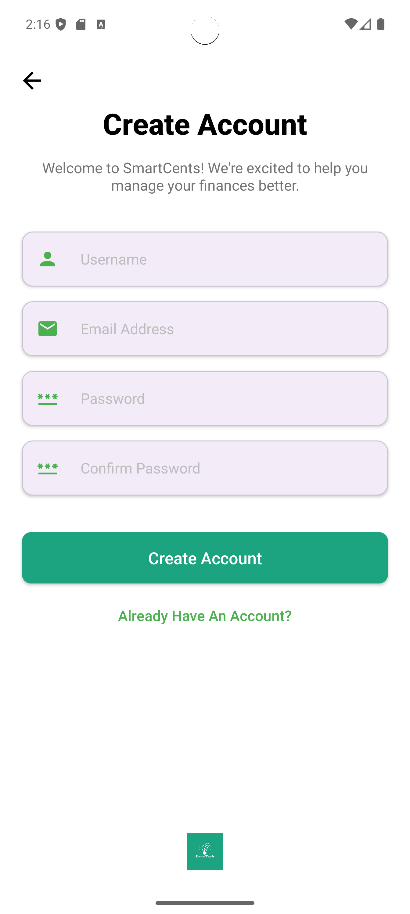
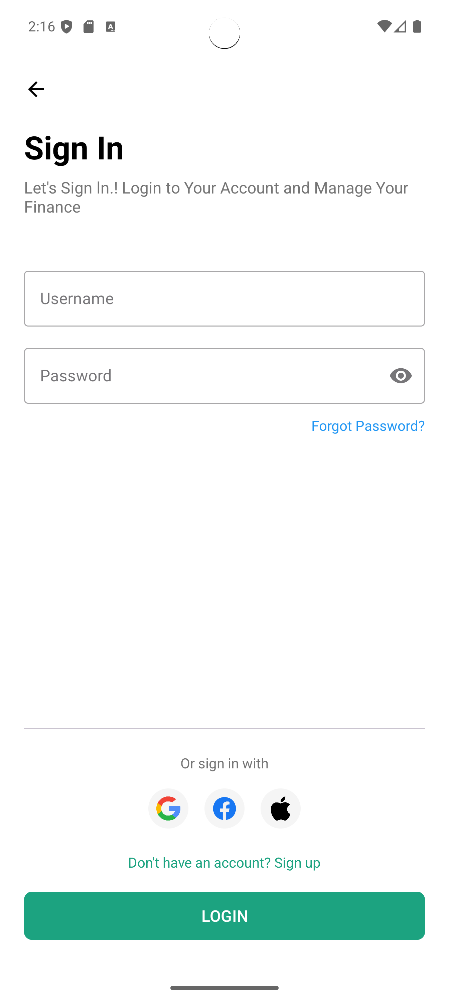
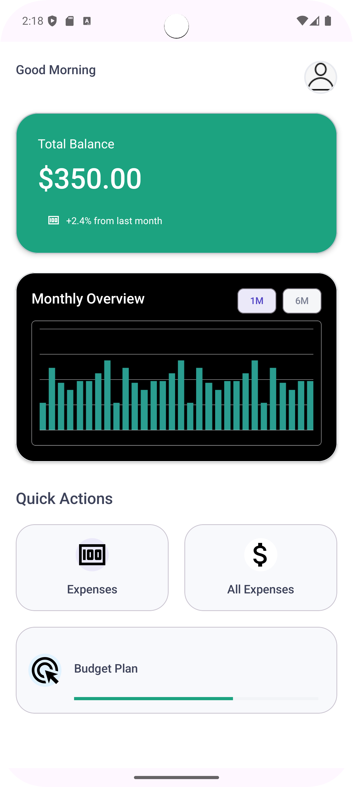
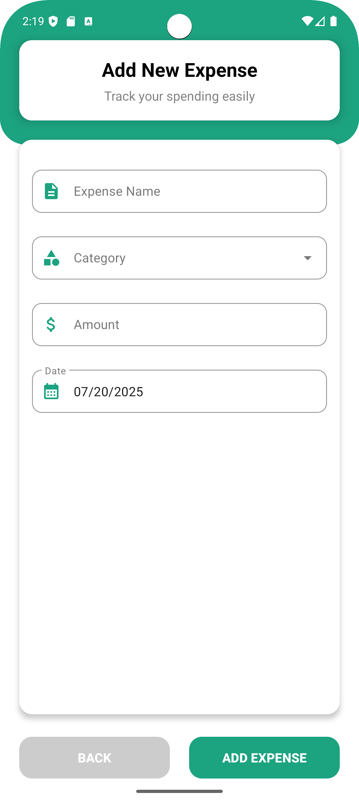
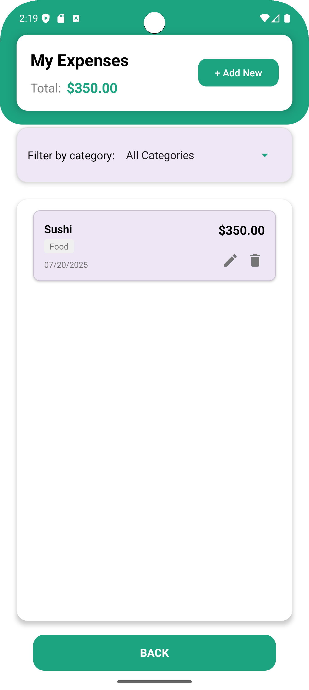
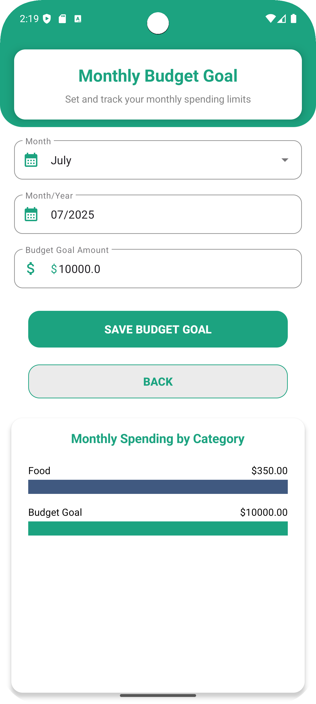

# 🚀 SmartCents

<p align="center">
  
</p>

<p align="center">
  <b>Take control of your finances.</b><br>
  <i>Track expenses, set budgets, and achieve your financial goals with ease and style.</i>
</p>

---

## 🌟 Why SmartCents?

SmartCents is your ultimate personal finance companion! Designed with a sleek, modern interface, SmartCents makes budgeting simple, enjoyable, and visually engaging. Whether you're a student, young professional, or family, SmartCents helps you make sense of every cent.

---

## ✨ Features

- **🚦 Friendly Onboarding**  
  Start your journey with easy, step-by-step onboarding screens.

- **🔒 Secure Authentication**  
  Sign up and sign in with confidence.

- **🏠 Beautiful Dashboard**  
  Instantly see your current balance, upcoming goals, and recent activity.

- **📝 Effortless Expense Management**  
  Add, view, and categorize your expenses in seconds.

- **📊 Intelligent Budget Tracking**  
  Set monthly budget goals and visualize your progress with clear visuals.

- **🔔 Smart Alerts**  
  Get notified when you're about to exceed your budget.

---

## 📱 Screenshots

<p align="center">
  
  
  
  
  
  
  
  
  
</p>

---

## ⚡️ Quick Start

1. **Clone the repository**
   ```bash
   git clone https://github.com/Wimukthi316/SmartCents.git
   cd SmartCents
   ```

2. **Open in Android Studio**  
   Launch [Android Studio](https://developer.android.com/studio), select "Open an existing project", and choose SmartCents.

3. **Build & Run**  
   Connect your Android device or start an emulator, then hit <b>Run</b>!

---

## 🛠️ Tech Stack

- **Kotlin** – Modern language for Android development
- **Android SDK** – Native mobile features & UI
- **Material Design** – Clean, beautiful, and intuitive interface
- **SharedPreferences + Gson** – Secure local data storage
- **Firebase Crashlytics** – Crash reporting & analytics

---

## 📂 Project Structure

```
app/
 ├─ SmartCentIMG/
 │    ├─ AddExpensePage.png
 │    ├─ AllExpensePage.png
 │    ├─ BudgetPage.png
 │    ├─ Home.png
 │    ├─ Logo.png
 │    ├─ OnBoarding01.png
 │    ├─ OnBoarding02.png
 │    ├─ SignIn.png
 │    └─ SignUp.png
 └─ src/
     └─ main/
         └─ java/com/example/smartcents/
             ├─ Expense.kt
             ├─ ExpenseRepository.kt
             ├─ BudgetGoal.kt
             ├─ BudgetGoalRepository.kt
             ├─ ExpenseAdapter.kt
             ├─ Screen06.kt
             ├─ Screen07.kt
             ├─ Screen08.kt
             └─ Screen09.kt
```

---

## 🤝 Contribution

Have ideas or want to help improve SmartCents?  
Fork the repo, open an issue, or submit a pull request — contributions are always welcome!

---

<p align="center">
  <b>💰 Be Smart. Save More. Track Every Cent with <span style="color:#20bfa9;">SmartCents</span>! 💡</b>
</p>
